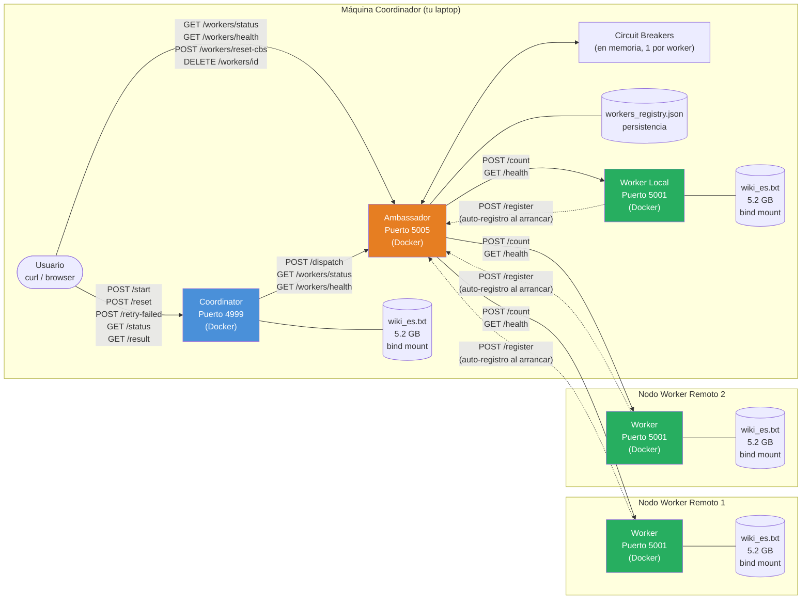
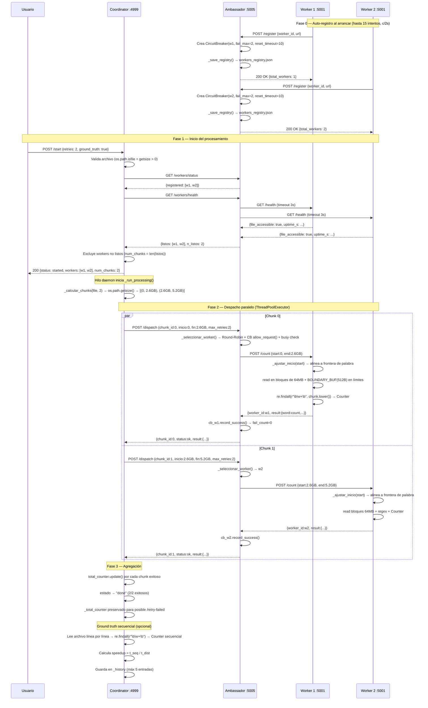
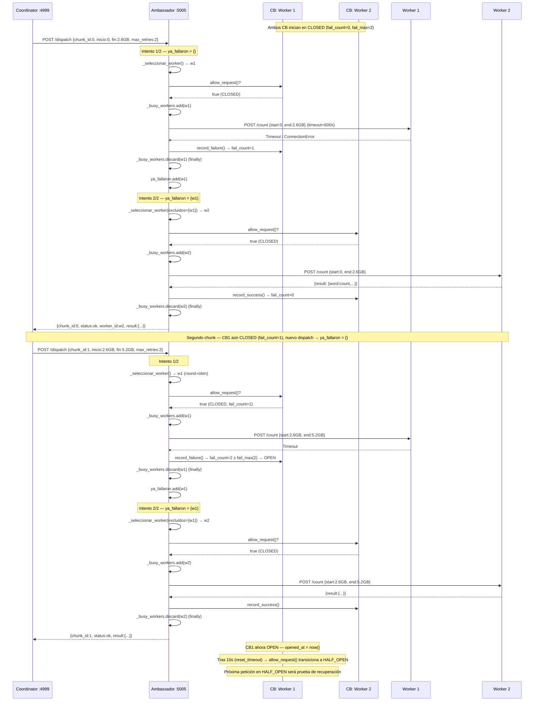
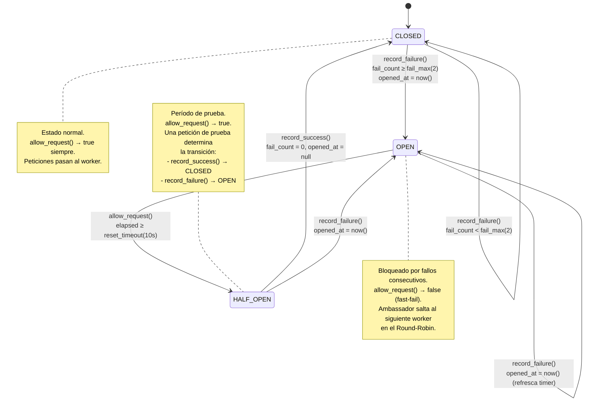
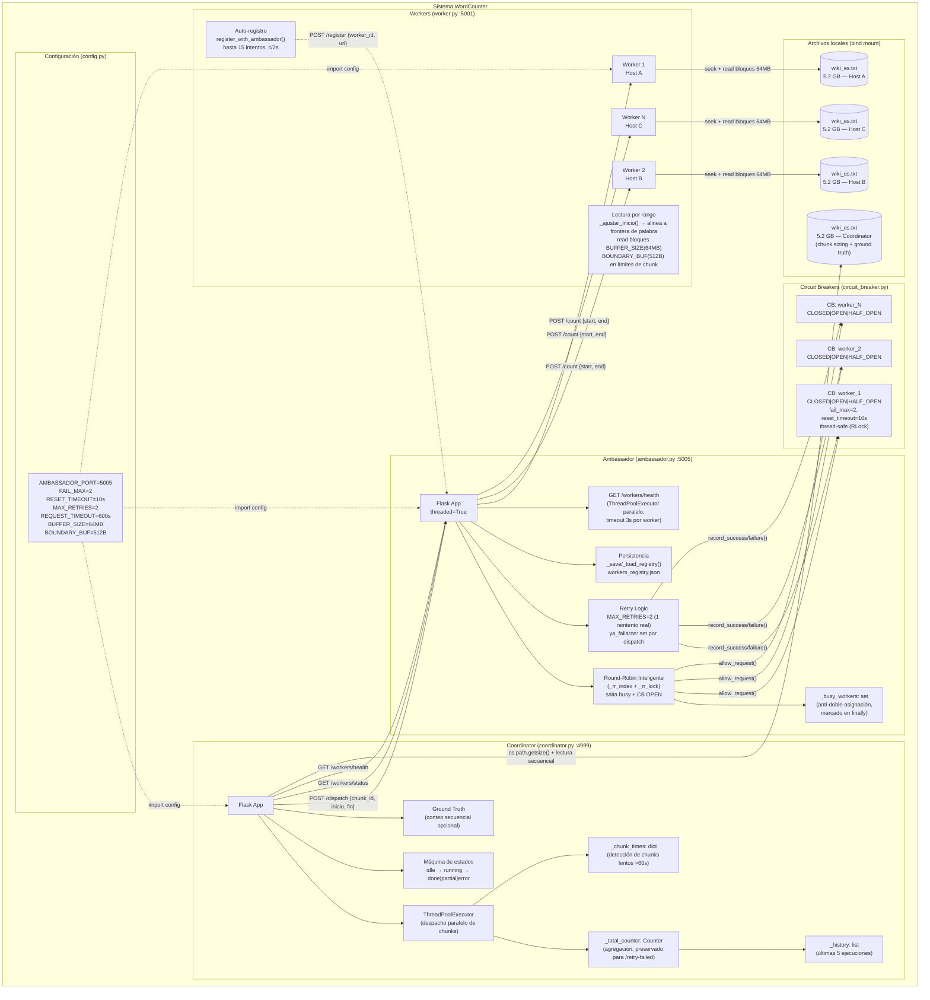
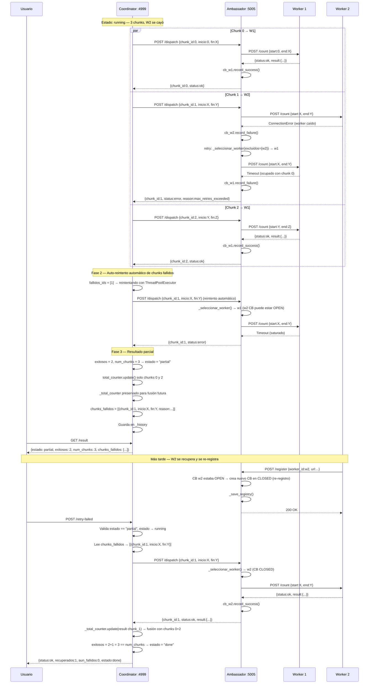

# Diagramas del Sistema WordCounter

## 1. Diagrama de Arquitectura

---

## 2. Diagrama de Secuencia

---

## 3. Diagrama de Secuencia con Circuit Breaker (escenario de fallo)

---

## 4. Diagrama de Estados de Circuit Breaker

---

## 5. Diagrama de Componentes

---

## 6. Diagrama de Secuencia — Fallo parcial y retry-failed

