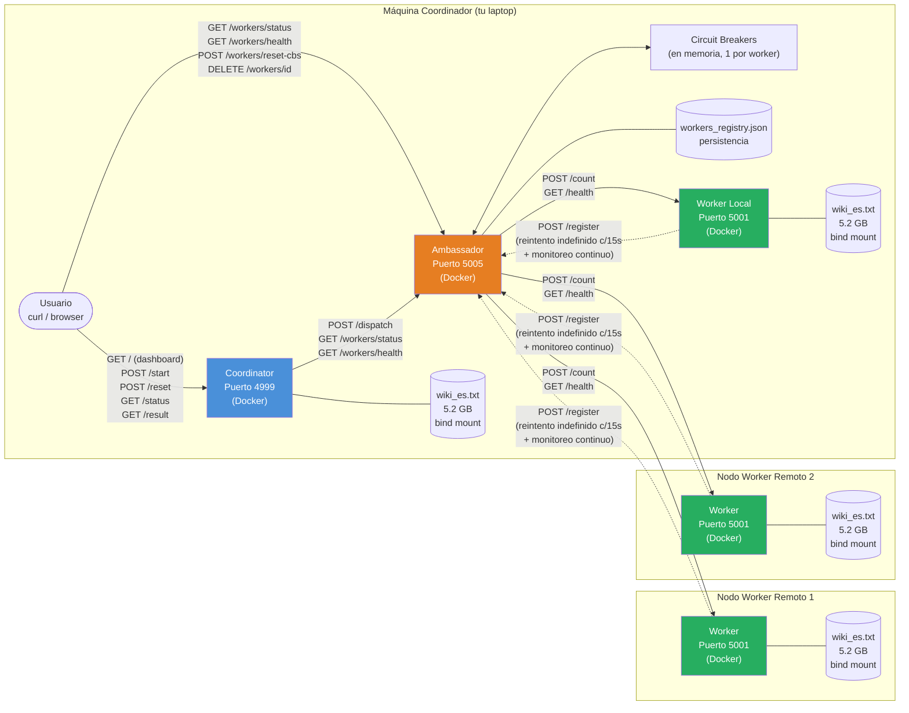
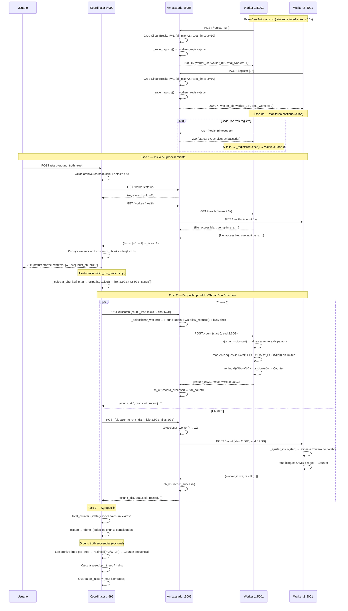
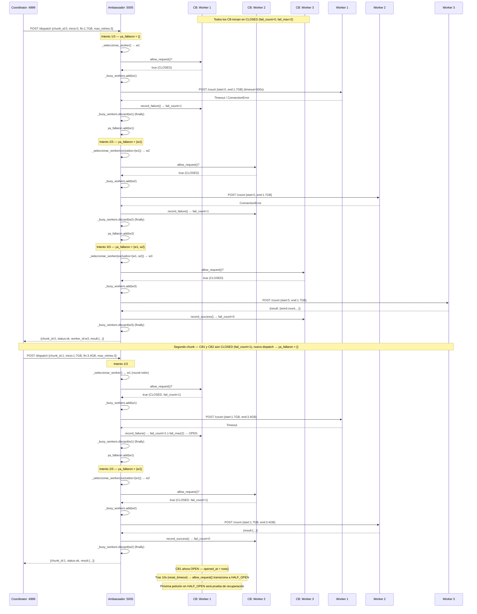
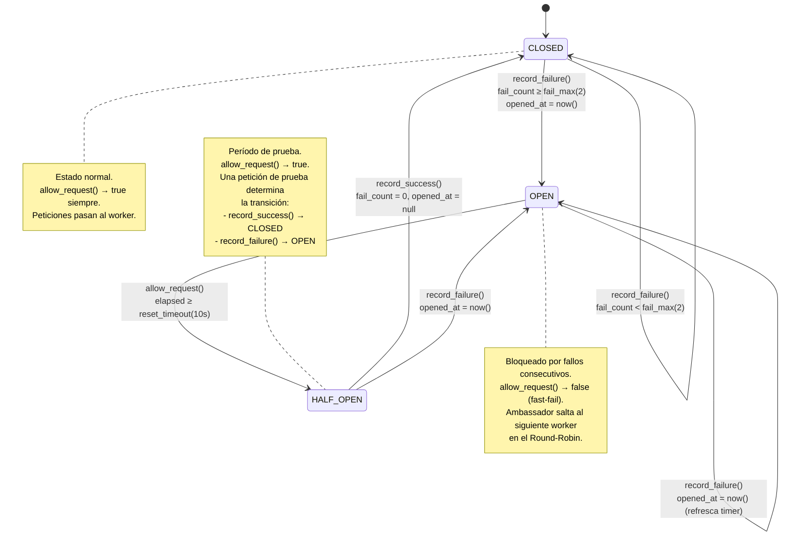
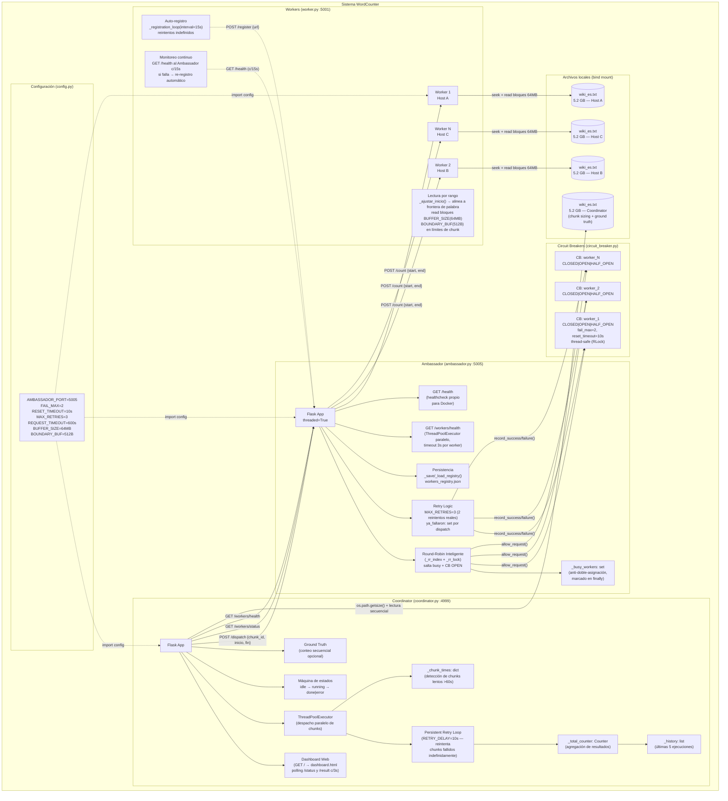

# Diagramas del Sistema WordCounter

## 1. Diagrama de Arquitectura

---

## 2. Diagrama de Secuencia

---

## 3. Diagrama de Secuencia con Circuit Breaker (escenario de fallo)

---

## 4. Diagrama de Estados de Circuit Breaker

---

## 5. Diagrama de Componentes

---

## 6. Diagrama de Secuencia — Reintentos persistentes automáticos (escenario de fallo)

```mermaid
sequenceDiagram
    participant U as Usuario
    participant CO as Coordinator :4999
    participant AM as Ambassador :5005
    participant W1 as Worker 1
    participant W2 as Worker 2

    Note over CO: Estado: running — 2 chunks (num_chunks = len(workers) = 2), W2 se cae

    par Chunk 0 → W1
        CO->>AM: POST /dispatch {chunk_id:0, inicio:0, fin:2.6GB}
        AM->>AM: _seleccionar_worker() → w1 (round-robin idx=0)
        AM->>AM: _busy_workers.add(w1)
        AM->>W1: POST /count {start:0, end:2.6GB}
        W1-->>AM: {worker_id:w1, result:{...}}
        AM->>AM: cb_w1.record_success() → fail_count=0
        AM->>AM: _busy_workers.discard(w1) (finally)
        AM-->>CO: {chunk_id:0, status:ok, result:{...}}
    and Chunk 1 → W2 (falla)
        CO->>AM: POST /dispatch {chunk_id:1, inicio:2.6GB, fin:5.2GB}
        AM->>AM: _seleccionar_worker() → w2 (round-robin idx=1)
        AM->>AM: _busy_workers.add(w2)
        AM->>W2: POST /count {start:2.6GB, end:5.2GB}
        W2--xAM: ConnectionError (worker caído)
        AM->>AM: cb_w2.record_failure() → fail_count=1
        AM->>AM: _busy_workers.discard(w2) (finally)
        AM->>AM: ya_fallaron.add(w2)
        Note over AM: Intento 2/3: _seleccionar_worker(excluidos={w2})
        Note over AM: w1 está en _busy_workers (chunk 0 aún procesa) → salta
        Note over AM: Ningún worker disponible → return None → 503 inmediato
        AM-->>CO: {chunk_id:1, status:error, reason:no_workers_available}
    end

    Note over CO: _run_processing: chunk_1 falló → pendientes = {chunk_1}
    Note over CO: Persistent Retry Loop — RETRY_DELAY = 10s

    CO->>CO: time.sleep(10) — espera antes de reintentar
    CO->>CO: intentos[1] = 2 (segundo intento a nivel Coordinator)

    Note over CO: Reintento persistente #1 — W1 ya está libre

    CO->>AM: POST /dispatch {chunk_id:1, inicio:2.6GB, fin:5.2GB}
    Note over AM: ya_fallaron = {} (set fresco por dispatch)
    AM->>AM: _seleccionar_worker() → w1 (CLOSED, fail_count=0)
    AM->>W1: POST /count {start:2.6GB, end:5.2GB}
    W1--xAM: Timeout (w1 sobrecargado)
    AM->>AM: cb_w1.record_failure() → fail_count=1
    AM->>AM: ya_fallaron.add(w1)
    Note over AM: Intento 2/3: _seleccionar_worker(excluidos={w1}) → w2
    AM->>AM: cb_w2: CLOSED, fail_count=1, allow_request()=true
    AM->>W2: POST /count {start:2.6GB, end:5.2GB}
    W2--xAM: ConnectionError (sigue caído)
    AM->>AM: cb_w2.record_failure() → fail_count=2 ≥ fail_max(2) → OPEN
    AM->>AM: ya_fallaron.add(w2)
    Note over AM: Intento 3/3: _seleccionar_worker(excluidos={w1,w2}) → None → 503
    AM-->>CO: {chunk_id:1, status:error, reason:no_workers_available}

    CO->>CO: time.sleep(10) — reintento persistente
    CO->>CO: intentos[1] = 3

    Note over CO: Reintento persistente #2

    CO->>AM: POST /dispatch {chunk_id:1, inicio:2.6GB, fin:5.2GB}
    AM->>AM: _seleccionar_worker() → w1 (CLOSED, fail_count=1)
    AM->>W1: POST /count {start:2.6GB, end:5.2GB}
    W1--xAM: Timeout
    AM->>AM: cb_w1.record_failure() → fail_count=2 ≥ fail_max(2) → OPEN
    AM->>AM: ya_fallaron.add(w1)
    Note over AM: Intento 2/3: w2 CB OPEN, allow_request()=false (elapsed<10s) → salta
    Note over AM: _seleccionar_worker(excluidos={w1}) → None → 503
    AM-->>CO: {chunk_id:1, status:error}

    CO->>CO: time.sleep(10) — el loop nunca se detiene
    CO->>CO: intentos[1] = 4

    Note over W2: W2 se recupera y su _registration_loop se re-registra

    W2->>AM: POST /register {url}
    AM->>AM: CB w2 estaba OPEN → crea nuevo CB en CLOSED (re-registro)
    AM->>AM: _save_registry()
    AM-->>W2: 200 OK {worker_id: w2}

    Note over CO: Reintento persistente #3
    Note over AM: CB w1: OPEN, 10s transcurridos → allow_request() transiciona a HALF_OPEN

    CO->>AM: POST /dispatch {chunk_id:1, inicio:2.6GB, fin:5.2GB}
    AM->>AM: _seleccionar_worker() → w1 (HALF_OPEN, allow_request()=true)
    AM->>W1: POST /count {start:2.6GB, end:5.2GB}
    W1--xAM: Timeout
    AM->>AM: cb_w1.record_failure() → HALF_OPEN → OPEN
    AM->>AM: ya_fallaron.add(w1)
    Note over AM: Intento 2/3: _seleccionar_worker(excluidos={w1}) → w2 (CLOSED, re-registrado)
    AM->>W2: POST /count {start:2.6GB, end:5.2GB}
    W2-->>AM: {worker_id:w2, result:{...}}
    AM->>AM: cb_w2.record_success() → fail_count=0
    AM-->>CO: {chunk_id:1, status:ok, worker_id:w2, result:{...}}

    Note over CO: Todos los chunks completados — pendientes = {}

    CO->>CO: total_counter.update() con resultados de chunks 0 y 1
    CO->>CO: reintentos_totales = sum(intentos[i] - 1) = 3 (chunk_0: 0, chunk_1: 3)
    CO->>CO: estado → "done" (siempre llega a 100%)
    CO->>CO: Guarda en _history (máx 5 entradas)

    Note over CO: Ground truth (si habilitado)
    CO->>CO: Conteo secuencial → speedup = t_seq / t_dist

    U->>CO: GET /result
    CO-->>U: {estado: done, exitosos: 2, num_chunks: 2, reintentos_totales: 3, ...}
```

